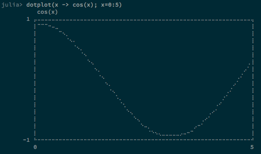
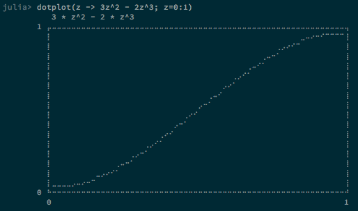

DotPlot.jl
==========

Fancy terminal plotting for Julia using Braille characters.
Inspired by [Drawille](https://github.com/asciimoo/drawille) but not based on it
due to its restrictive license (AGPL). DotPlot.jl is free for all under the MIT
license.

DotPlot.jl aims for as much elegance and aesthetics as possible for a terminal
(unicode) plotting library. It should be able to plot any continuous real-valued
function.





Screenshots taken in iTerm2 on a Mac using the
[Adobe Source Code Pro font](https://github.com/adobe/source-code-pro).

### INSTALLATION

```julia
Pkg.add("DotPlot")
```

### USAGE

DotPlot.jl is very simple to use: just pass a function and a range to dotplot():
```julia
using DotPlot

dotplot(x -> cos(x); x=-1:1)
```

You can also pass functions by name:
```julia
dotplot(sin; x=-5:5)
```

DotPlot.jl will attempt to generate a smart label for the graph based on the
input function. If you supply a single-line function, the source of the function
will be used as the label. If you supply a named function, the name of the
function is used for the label.

Plots are scaled from min(f(x)) to max(f(x)) automatically; you cannot supply a
range for the vertical axix.
