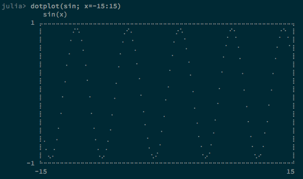
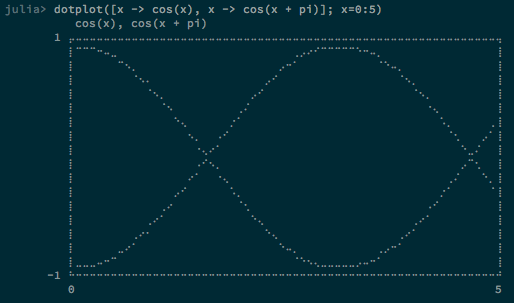

TextPlot.jl
==========

[](https://travis-ci.org/sunetos/TextPlot.jl)
[](https://coveralls.io/r/sunetos/TextPlot.jl)


Fancy terminal plotting for Julia using Braille characters.
Inspired by [Drawille](https://github.com/asciimoo/drawille) but not based on it
due to its restrictive license (AGPL). TextPlot.jl is free for all under the MIT
license.

TextPlot.jl aims for as much elegance and aesthetics as possible for a terminal
(unicode) plotting library. It should be able to plot any continuous real-valued
function, and any small-to-medium collection of points.






Screenshots taken in iTerm2 on a Mac using the
[Adobe Source Code Pro font](https://github.com/adobe/source-code-pro).

### INSTALLATION

TextPlot.jl currently has no dependencies on other packages. It has only been
tested against Julia v0.3 nightly builds on a Mac.

```julia
julia> Pkg.add("TextPlot")
```

### USAGE

TextPlot.jl is very simple to use: just pass a function and a range to plot():
```julia
using TextPlot

plot(x -> cos(x); x=-1:1)
```

You can also pass functions by name:
```julia
plot(sin; x=-5:5)
```

Plotting multiple functions is as easy as passing an array of functions:
```julia
plot([x -> cos(x), x -> cos(x + pi)]; x=0:5)
```

TextPlot.jl will attempt to generate a smart label for the graph based on the
input function. If you supply a single-line function, the source of the function
will be used as the label. If you supply a named function, the name of the
function is used for the label.

Plots are scaled from min(f(x)) to max(f(x)) automatically; you cannot supply a
range for the vertical axis.

Most graph features are configurable; you can toggle the border, title, and axis
labels.
